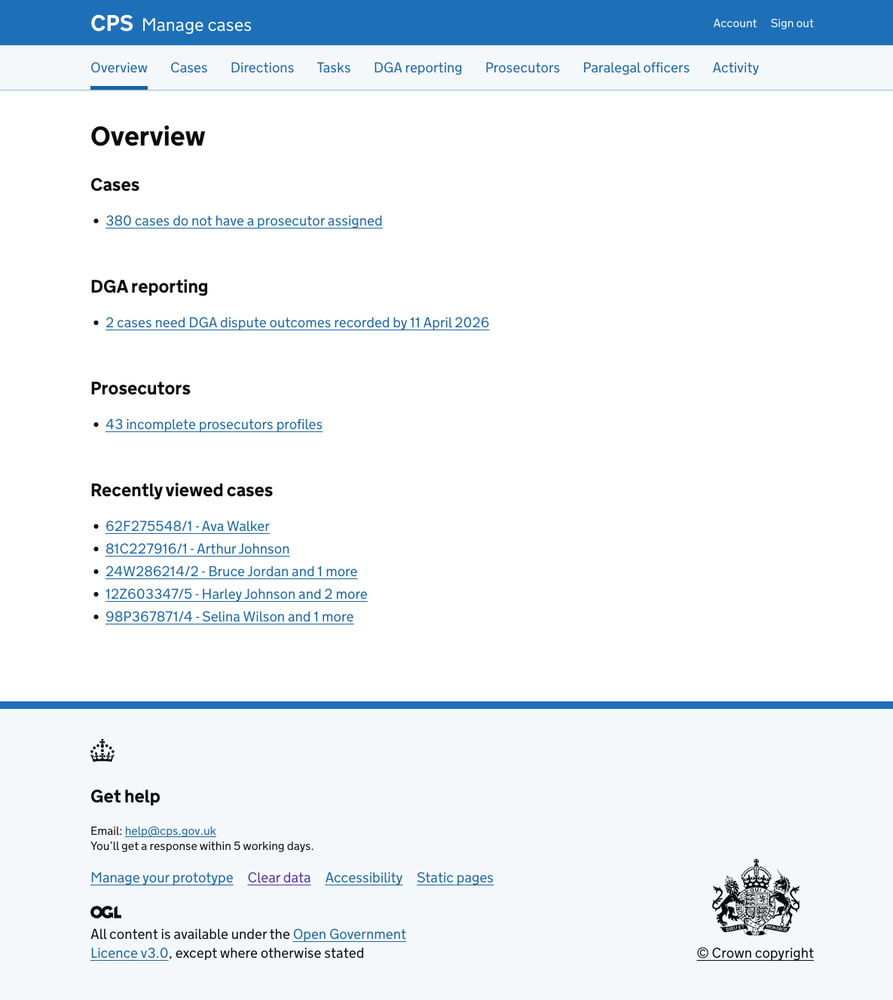

The overview page gives legal managers a summary of things that need their attention across the service — cases without a prosecutor, outstanding DGA reporting tasks, and incomplete prosecutor profiles.

## How it works

The overview page is the first page managers see after signing in. It surfaces time-sensitive information so managers can quickly identify what needs action without browsing through individual sections.

### Cases

Shows the number of cases that do not have a prosecutor assigned. Selecting this link takes the manager to the case list, pre-filtered to show unassigned cases.

### DGA reporting

Shows the number of cases that need DGA dispute outcomes recorded for the most recent reporting month, along with the deadline. Selecting the link takes the manager to the [DGA reporting page for that month](../2026-03-20-dga-reporting-month-page-iteration/).

This section only appears when there are cases with outstanding outcomes. Once all outcomes are recorded, the section is hidden.

### Prosecutors

Shows the number of prosecutors with incomplete profiles. Selecting this link takes the manager to the prosecutors list.

### Recently viewed cases

Shows the last 5 cases the manager has opened, so they can quickly return to recent work.
