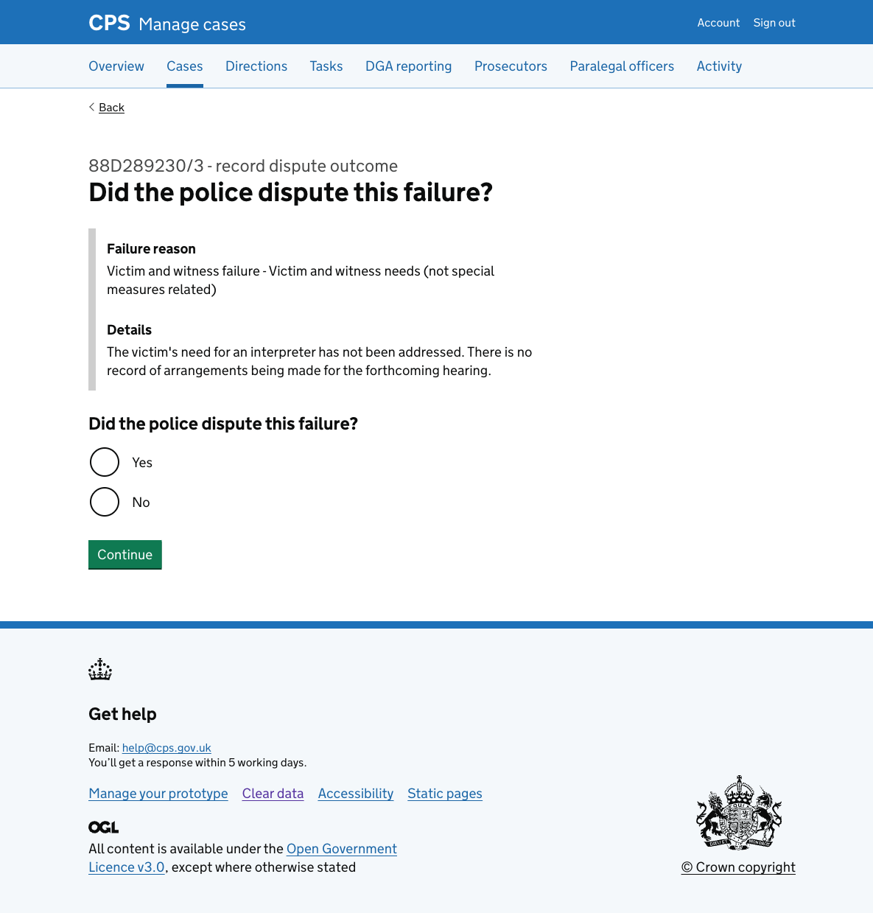
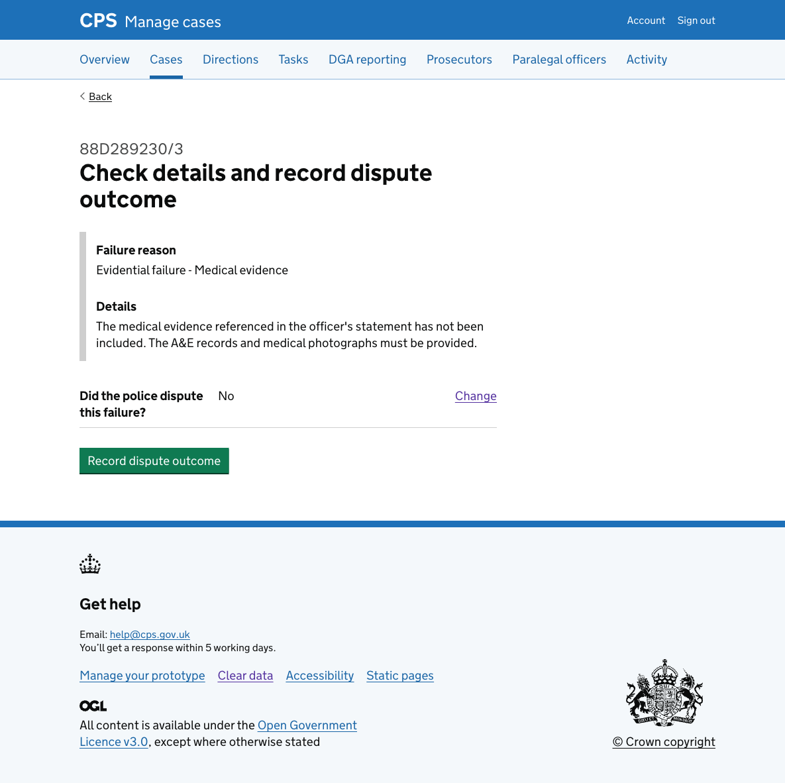
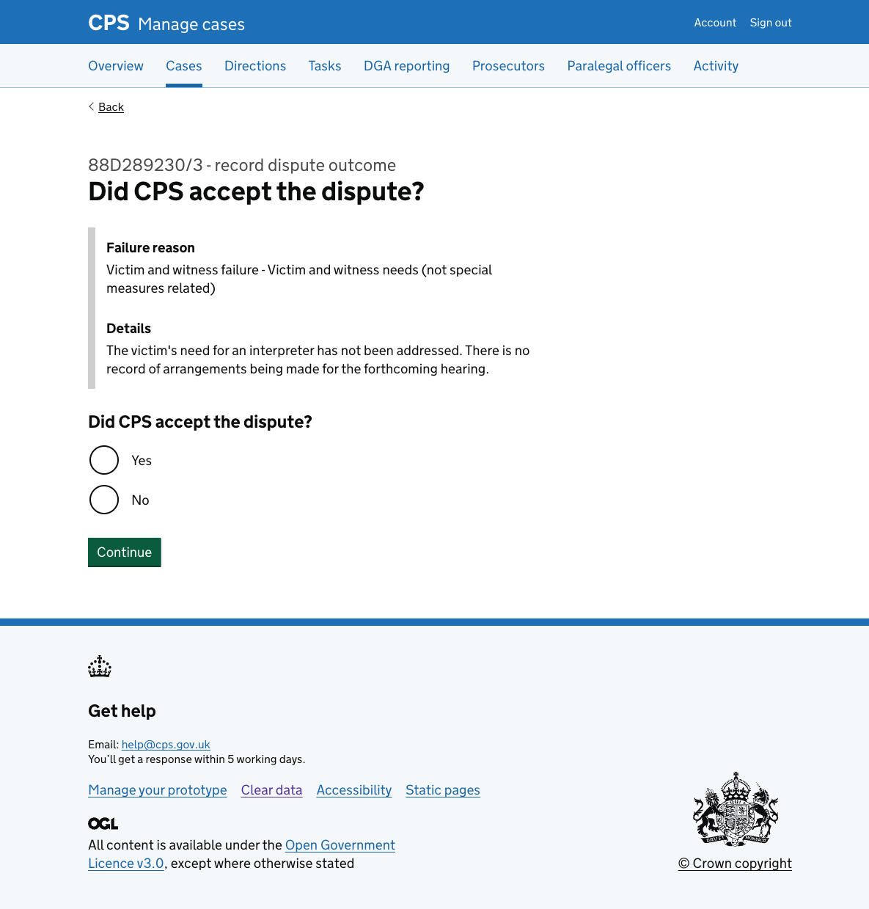
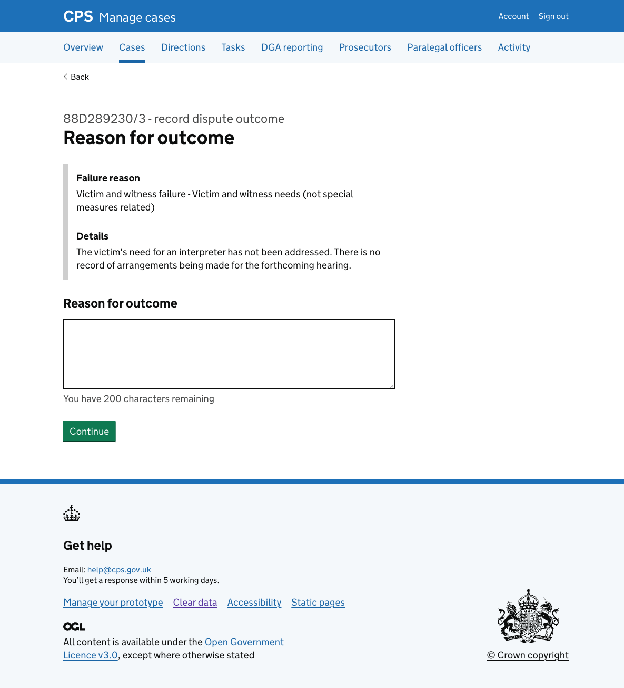
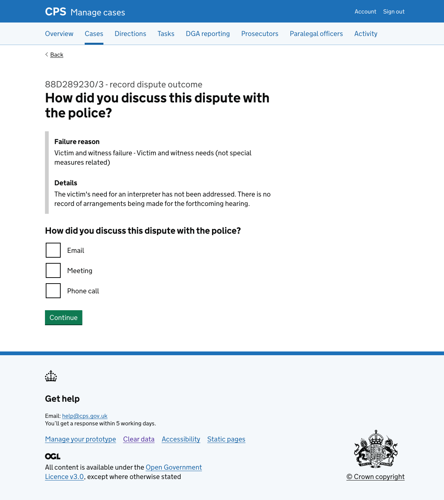
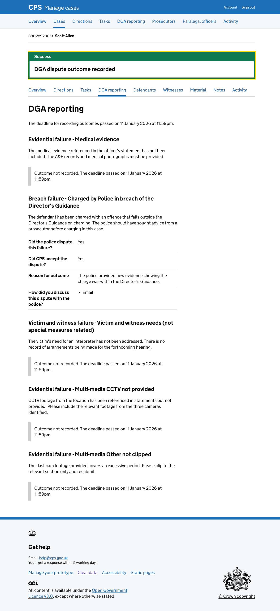

We previously [designed a flow for recording a dispute outcome](https://cps-new-design-history-2189687bc35a.herokuapp.com/manage-cases/recording-a-dispute-outcome/).

We've iterated the flow as part of the wider DGA reporting iteration, changing how users reach it and the content on each step.

## What we changed

### Entry and exit points

Previously, users reached the flow from the dedicated DGA case list within the DGA reporting area, and returned to it after completing each outcome. 

The flow now starts from the [DGA reporting page for a case](../2026-03-20-viewing-dga-details-for-a-case/) and returns there on completion.

### Added failure details to the inset

The previous design showed the failure reason category in the inset — for example, "Evidential failure - Medical evidence". This alone did not give legal managers enough information to accurately answer the questions. To record the outcome properly, they needed to know the specific circumstances of the failure in that case.

We added a "Details" field to the inset, which shows the notes describing what actually went wrong — for example, which evidence was missing and what needed to be provided. This is shown on every page of the flow so users do not have to navigate away.

## How it works

Users reach the flow from the [DGA reporting tab on a case](../2026-03-20-viewing-dga-details-for-a-case/), by selecting "Record dispute outcome" for a specific failure reason.

The first question asks whether the police disputed the failure.

### If the police did not dispute the failure

If the user selects ‘No’, they go straight to a check page. Only the dispute question is shown in the summary, since no further details are needed.

### If the police disputed the failure

If the user selects ‘Yes’, they are asked three further questions:

**Did CPS accept the dispute?**

**Reason for outcome** — a free text field for the legal manager to explain the basis for the decision.

**How did you discuss this dispute with the police?** — checkboxes for Email, Meeting, or Phone call.

The check page shows all four answers with Change links.

### After recording

After confirming, the user is returned to the case's DGA reporting tab with a "DGA dispute outcome recorded" success banner.

## Error messages

### Did the police dispute this failure?

- Nothing selected: "Select yes if the police disputed this failure"

### Did CPS accept the dispute?

- Nothing selected: "Select yes if CPS accepted the dispute"

### Reason for outcome

- Empty: "Enter a reason for outcome"
- Too long: "Reason for outcome must be 200 characters or fewer"

### How did you discuss this dispute with the police?

- Nothing selected: "Select how you discussed this dispute with the police"
