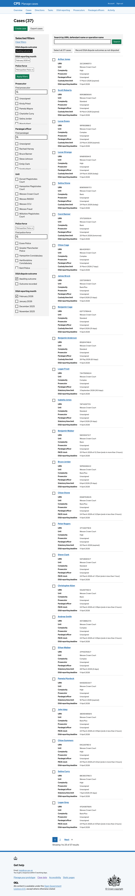
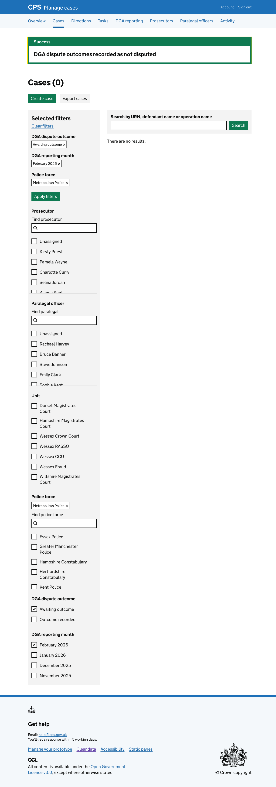

Legal managers sometimes need to record the same outcome — not disputed — across many cases at once, for example at the end of a reporting period. Doing this one case at a time is slow and repetitive.

We added a bulk action to the case list that lets users record multiple DGA dispute outcomes as not disputed in a single flow.

## How it works

Users reach the case list by clicking "Record dispute outcomes" on the [DGA reporting page for a month](../2026-03-20-viewing-dga-details-for-a-case/). The case list is pre-filtered to show cases that are awaiting an outcome for the selected police force and reporting month.

Alongside each case is a checkbox. Above the list are two action buttons: "Select all X cases" and "Record DGA dispute outcomes as not disputed".

Users can select cases individually using the checkboxes, or click "Select all X cases" to select all cases across all pages at once.

After selecting cases, the user clicks "Record DGA dispute outcomes as not disputed". They are taken to a confirmation page that lists all the selected cases.

If any selected cases already have all their outcomes recorded, they are excluded from the list and a note explains how many were skipped.

After confirming, the user is returned to the case list with a "DGA dispute outcomes recorded as not disputed" success banner. Cases that have been updated no longer appear under the "Awaiting outcome" filter.

