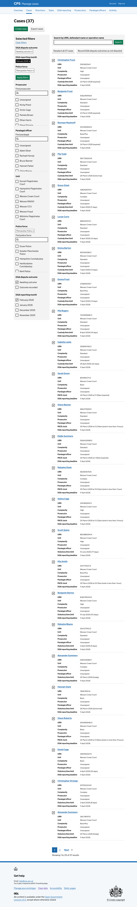
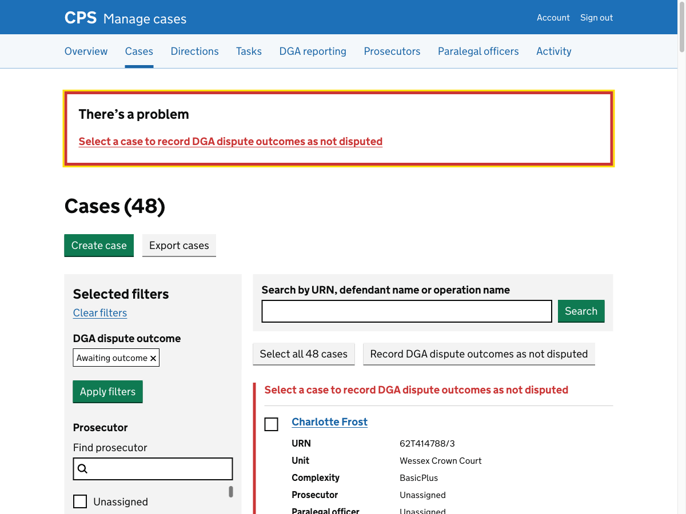
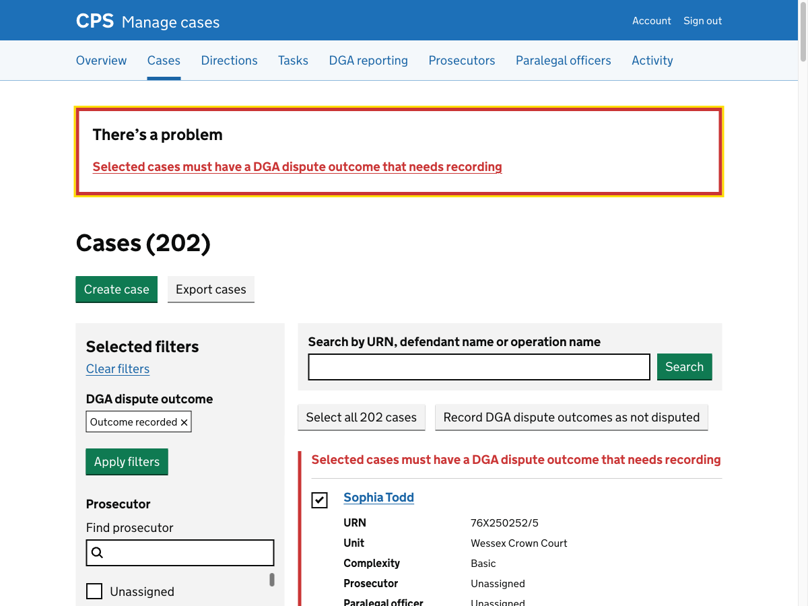

At the moment, legal managers do not record outcomes that are not disputed. 

But this means we cannot tell the difference between an outcome that was not recorded and one that was not disputed. So we are now asking users to record outcomes even if they are not disputed.

To make this quick, we’ve given users a way to easily record multiple cases as not disputed at once.

## How it works

Users reach the case list by clicking "Record dispute outcomes" on the [DGA reporting page for a month](../2026-03-10-dga-reporting-month-page-iteration/). The case list is pre-filtered to show cases that are awaiting an outcome for the selected police force and reporting month.

Each case has a checkbox.

Users can select cases individually using the checkboxes, or click "Select all 37 cases" to select all cases across all pages at once. 

The page refreshes with all cases selected and the button changes to "Deselect all 37 cases".

After selecting cases, the user clicks "Record DGA dispute outcomes as not disputed". They are taken to a confirmation page that lists all the selected cases.

If any selected cases already have all their outcomes recorded, they are excluded from the list and a note explains how many were skipped.

After confirming, the user is returned to the case list with a "DGA dispute outcomes recorded as not disputed" success banner. Cases that have been updated no longer appear under the "Awaiting outcome" filter.

If the user clicks "Record DGA dispute outcomes as not disputed" without selecting any cases, they get an error that says “Select a case to record DGA dispute outcomes as not disputed”.

If the user selects cases but none of them have any outcomes that need recording, they get an error that says “Selected cases must have a DGA dispute outcome that needs recording”.

## Future considerations

### Allowing users to upload a completed spreadsheet

The current flow requires legal managers to re-enter data that already exists in a spreadsheet. 

APMs export a spreadsheet of DGA cases, share it with police forces to capture dispute outcomes, and legal managers then copy those results into the service.

We want to consider allowing users to upload the spreadsheet, removing the need to re-enter data manually.

One risk is that police forces could corrupt the spreadsheet — by adding columns, changing formatting, or altering data.
