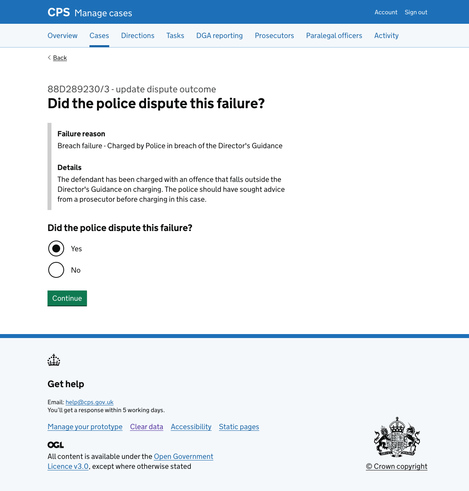
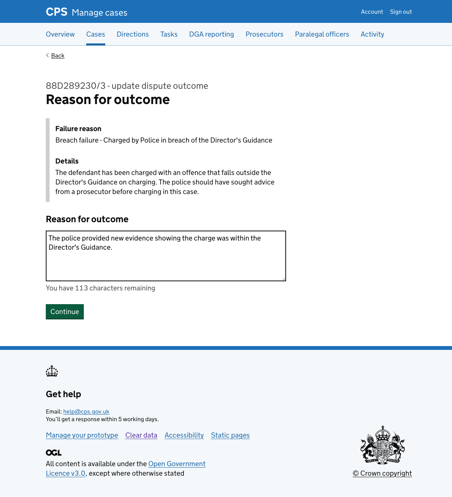
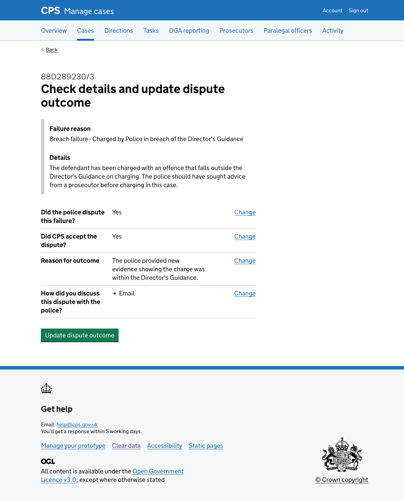

Legal managers can update a previously recorded DGA dispute outcome by clicking a change link on the [DGA reporting page for a case](../2026-03-20-viewing-dga-details-for-a-case/).

## How it works

The update flow has the same structure and pages as [recording a dispute outcome](../2026-03-23-recording-a-dga-dispute-outcome/). The key difference is that each page is pre-populated with the previously recorded answers.

### Changing a single answer

When the user clicks "Change", they are taken directly to that question. After answering, they return straight to the check answers page rather than continuing through every subsequent step.

This works well when the answer being changed does not affect later questions — for example, updating the reason for outcome without needing to revisit the CPS acceptance or discussion method questions.

However, if the user changes "Did the police dispute this failure?" from No to Yes, they are not returned to the check page immediately. Because the dispute questions (did CPS accept? reason for outcome? discussion method?) have never been answered, the user must complete them before they can reach the check page. This is the same path as recording a new disputed outcome for the first time.

### Check answers page

The check page shows all answers with change links.

After confirming, the user is returned to the case's DGA reporting tab with a "DGA dispute outcome updated" success banner.

## Error messages

### Did the police dispute this failure?

- Nothing selected: "Select yes if the police disputed this failure"

### Did CPS accept the dispute?

- Nothing selected: "Select yes if CPS accepted the dispute"

### Reason for outcome

- Empty: "Enter a reason for outcome"
- Too long: "Reason for outcome must be 200 characters or fewer"

### How did you discuss this dispute with the police?

- Nothing selected: "Select how you discussed this dispute with the police"
